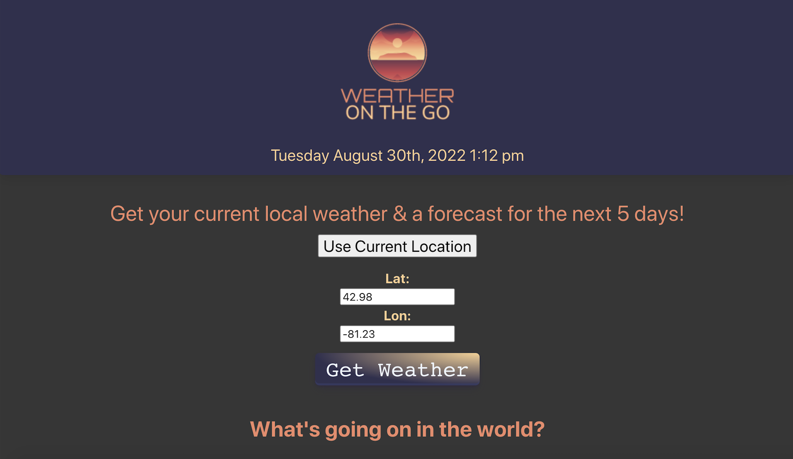
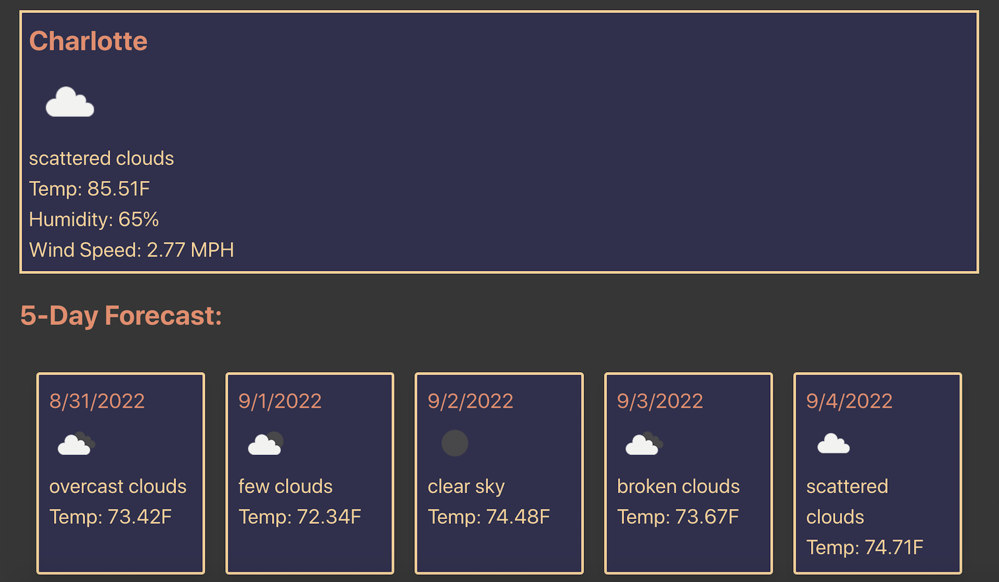
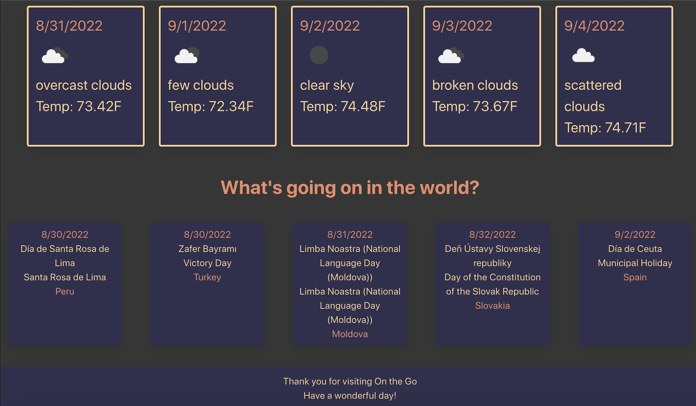

# Weather On The Go

## About this App

### Description

An application that displays the current weather along with a 5-day forecast for any specfied longitude and latitude. The application also displays the next 5 international Observances and Holidays.

### User Story

As a user about leave home, I would like an application that allows me to see the weather. When I am on the homepage, I am presented with a form to either enter a location or use my current location, along with an area that displays the next 5 international Observances and Holidays. After submitting the form, I am presented with the current weather along with a 5-day forcast for that location.

### Features

1. Users can use the form to either enter a certain set of longitude and latitude points, or use their current location to obtain a weather forcast.
2. The application displays the city name, temperature, humidity, and wind speed for the location provided along with a picture and deciprtion for the weather.
3. The application displays the date and country that the next 5 international Observances and Holidays are celebrated on/by, as well as both the native name and English name for the holiday.

### Built With

- HTML
- CSS
- Bulma
- JavaScript
- JQuery
- Open Weather Api
- Nager.Date API
- MomentJS

## Deployed Application

<a href="https://calebfunderburk.github.io/On-The-Go/" target="_blank">Click here</a> to view this application.

## Installation

This program can be run through a browser using the above link to the deployed application. In order to run this program locally you will need to:

* Clone this repository to receive all the files.

## Screenshots

## Contributions

- David Townsend
- Allison Venning
- Kenan Mckenzie
- Caleb Funderburk
